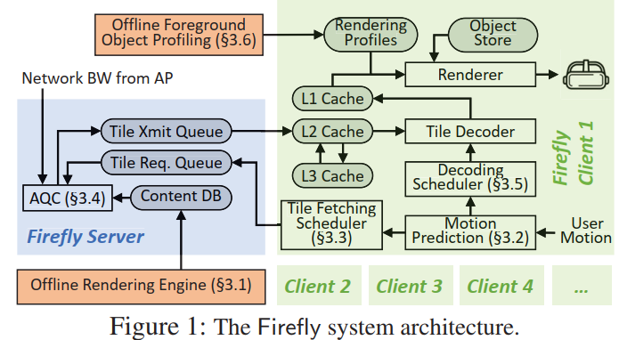
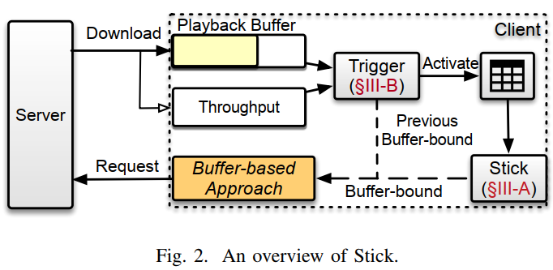

# paper reading

This is a document recording some papers I read every week from April, 2021.

## keyword

#abr #video_system #live #VR #360 #viewport_prediction

## papers

+ **Popularity-Aware 360-Degree Video Streaming**

21 Infocom The Pennsylvania State University  #360

这篇文章的贡献在于macrotiles。传统的360 streaming会把视频分割成多个tile，每个tile单独编码，但是这样会使得tile之间无法进行运动补偿编码，影响编码性能。因此，作者提出将用户集中观看的区域（ROI）单独编码，其他依然采用tile编码。这样ROI可以单独编码为高质量，且画面较大可以使用帧间补偿，提高编码效率。

作者首先formulate一个QoE maximization问题，用多重背包证明为NP-hard。

然后，作者提出聚类方法来获取ROI区域，这块区域可单独编码。

针对当前用户，作者首先预测viewport，然后看是否有覆盖它的ROI，如果有，该ROI在带宽约束下尽可能下载最高码率，其他区域下载最低码率。否则，跟传统的tile方法一样，设计一个简单的方法分配viewport和其他区域的码率。

+ **PARIMA: Viewport Adaptive 360-Degree Video Streaming**

21 WWW Indian Institute of Technology Kharagpur, India   #viewport_prediction

这篇论文做的主要是viewport prediction。作者提出了用prime objects和user trajectories来预测。本文创新点主要在于提取出object的高层特征。

预测上，作者先用ARIMIA模型预测出观看轨迹，然后用Passive-Aggressive Regression model融合不同特征。

不过基于objects的思想跟[这篇](https://dl.acm.org/doi/10.1145/3328914)比较像。

+ **SphericRTC: A System for Content-Adaptive Real-Time 360-Degree Video Communication**

20 MM SUNY Binghamton #360

这篇文章有点像在codec上面优化，然后结合到WebRTC中。作者在优化方面，主要是确定per-pixel magnification，像素点离viewpoint越近，编码的分辨率越高，则像素点越被放大（我的理解应该是越密集）。

作者基于viewpoint的向量和每个像素点的向量依次计算角度差，然后推导出像素点大小$g$。作者这里更多的是依据视角和给定的分辨率确定每个像素点的大小（密度），网络调整部分应该是依赖webtrc本身。

+ **Firefly: Untethered Multi-user VR for Commodity Mobile Devices**

20 ATC University of Minnesota, Twin Cities #VR

这篇文章讲VR的渲染。优化的技术有：offline content preparation（提前将background在服务器端渲染和编码好）、viewport-adaptive streaming（划分tile，预测用户的viewport背景并下载）、adaptive content quality control（在多用户场景下，分配有限的带宽资源）。作者分析该系统能支持15个用户和60FPS帧率。

1. offline rendering engine: 作者在水平方向上将帧划分为多个tile，并备好多个质量版本，提前渲染和编码好，存储在数据库中等待下载。
2. viewport prediction: 这里的坐标有translational movement (x,y,z)和rotational movement (yaw, pitch)。作者训练前50ms的线性模型来预测未来150ms的。这里的时间粒度是毫秒级的。同时，作者采用扩大FoV，用户静止时增加tile数量等策略。（防止静止后突然移动）
3. Adaptive Quality Control. 作者提出一个简单的算法给多用户分配带宽资源，确定各tile下载的质量。
4. Client-Side Hierarchical Cache. 作者在客户端实现多级缓存，L1存储已解码的tile，L2和L3存储待解码的tile，L2的速度更快，存储更紧急的tile。
5. Handling Dynamic Foreground Objects. 跟其他工作一样，作者在客户端渲染小的object。同时，作者依据客户端的资源决定渲染的质量。

作者在安卓实现了该系统。

+ **Stick: A Harmonious Fusion of Buffer-based and Learning-based Approach for Adaptive Streaming**

这篇文章的ABR是使用buffer-based算法。但是作者提出一个问题：在不同带宽、视频情形下，BB的buffer-bound应该具体去设置。因此，作者使用了一个DRL模型（DDPG）来决定buffer-bound大小。

同时，作者考虑到buffer-bound某段时间可以保持恒定。因此，设计一个Trigger算法，输入是带宽、缓存总大小和当前缓存，输出是使用当前缓存上限的概率，表示是否要激活DRL输出新的上限，节省资源。

+ **SenSei: Aligning Video Streaming Quality with Dynamic User Sensitivity**

21 NSDI University of Chicago

这篇文章讲的是同一个视频不同chunk用户的sensitivity是不一样的，比如足球比赛中射门时，用户对质量和卡顿要求更高，因为对应的QoE权重也更高。总体思想跟19ICNP的Hotdash一致。这里在不同chunk中加入卡顿，然后在Amazon MTurk 平台上请人观看打分，进一步拟合不同chunk的权重。

+ **Rubiks: Practical 360-Degree Streaming for Smartphones**

18 MobiSys UT Austin #video_system

作者在手机实现了360度视频系统并进行优化。优化包括：编码上，作者划分tile和划分layer（SVC）。传输优化上，作者建立QoE，考虑解码时间，变量为每个tile码率、layer的数目。求解采用搜索方式。

作者在安卓上进行实现，也是本文的亮点。

+ **Favor: Fine-Grained Video Rate Adaptation**

18 MMSys UT Austin #abr

这篇文章除了考虑传统的问题设置外，还增加了frame dropping和playout rate。frame dropping可以降低帧率，减小视频大小。playout rate可以减缓播放时间，避免卡顿。因此需要对QoE做优化。

在方法上，作者采用了类似MPC的方法，并利用贪心算法做分配。

作者基于VLC实现，客户端基于HTTP。

+ **Learning in situ: a randomized experiment in video streaming**

19 NSDI Stanford University [website](https://puffer.stanford.edu)  #abr

这篇论文的主要贡献在于构建了一个真实环境的streaming平台，供用户观看采集真实数据。以及提出用DNN(supervised learning)进行带宽预测+传统MPC优化方法（动态规划）进行码率控制的ABR算法。只是整篇文章读下来有点像技术报告。

从17年Pensieve以来，近些年的abr文章主要解决DRL无法泛化的问题，即实验（线下）和真实（线上）的差距。本文首先采集用户真实的观看数据，测量各算法的QoE，发现Pensieve的性能甚至不如传统的Buffer-Based。

Q：作者一直在强调真实环境，but真实环境比实验室模拟环境优势在哪里呢。实验室的带宽等也是从真实环境采集来的，其他的也没有太大差别吧，是不是实验室数据集足够大也可以逼近真实环境呢。

从算法角度，作者首先提出了一个基于DNN的监督学习预测带宽，输入见p7左上角，输出为已知大小的视频的传输时间bin的概率分布。

Q：传统比较直观的基于DL的带宽预测是用时序模型，如LSTM，来做。作者的这个方法的优势在哪里呢。是否是要取代LSTM呢。

接着，作者通过一个动态规划方法来求解码率，但这里介绍的实在有些简略。之前学习是在隐马尔可夫模型的维特比算法和RL的动态规划方法。这里DP会有两个维度，一个是水平的时序转移，这里是chunk i，一个是垂直的状态分布，这里是size s。在每一步chunk i，依次计算下一步i+1（作者是从后往前看，所以是i-1）的最大值v*和对应的状态转移概率的乘积。所以从动态规划的角度看，作者这里的区别在于：转移方向不同+由于是确定性测量，省略转移概率。而适中的Pr就是为了计算QoE引入的概率，跟动态规划或者说概率转移没有太大关系，更像是下一步中一个状态内($K_i^{s}$)的分裂。因此，作者这里适当增加一些解释会更好。（一开始看到那个公式+值迭代让我想到了RL的DP，还想说怎么不用循环求解呢。。）

ABR一直都是RL+传统两条路在竞争和融合，只是越来越有点各说各话了。

------------------------------------------------------------------------------------------------------------------------------------------------------

+ **PiTree: Practical Implementation of ABR Algorithms Using Decision Trees**  

19 MM Tsinghua University  #abr

采用决策树来转化传统的DRL-based ABR算法，使得算法更轻量级且性能不受大的影响。

+ **Ekya: Continuous Learning of Video Analytics Models on Edge Compute Servers**  

20 UC Berkeley #video analysis; #video_system

将continuous learning加入视频分析中，边推断边学习。

Continuous training on limited edge resources requires smartly deciding **when** to retrain each video stream’s model, **how much resources** to allocate, and **what configurations** to use. But making these decisions has two challenges.    

什么时候分配：每次训练完分配。资源：多少unit的GPU resources。configuration：number of training epochs, batch sizes, number of neurons in the last layer, number of frozen layers, and fraction of training data.

作者设计了一个启发式算法进行分配。估计分配后的准确率时，采用小的分析器进行估计。

+ **HotDASH: Hotspot Aware Adaptive Video Streaming using Deep Reinforcement Learning**  

18 ICNP，IIT Kharagpur, Kharagpur, India #abr

这一篇做的是热点视频片段的提前下载。观看视频时，经常会有用户更感兴趣的片段（比如比赛关键时刻），在网络状况好时，提前下载这些片段的高清版本，使得这些片段有更高的质量。

作者改进自pensieve，采用DRL求解，对于每个时刻，决定下一个普通chunk的码率，决定下一个hotspot chunk的码率，再决定是否要下载hotspot chunk。

作者实现了一个比较完整的系统，ABR决策在服务端作为一个service。计算hotspot时采用不同的QoE质量函数，得到的值会更高。

+ **User Centered Adaptive Streaming of Dynamic Point Clouds with Low Complexity Tiling**

这篇文章没有完全get到。讲的是volumetric video的传输，可以跟360度视频一样分割tile。本文是依据拍摄的摄像机进行分割，从object中心映射到各个point，然后看该向量跟哪个摄像头的向量接近（我的理解）。分割成tile后，就可以有不同的质量表示，然后依据用户的坐标和视野请求对应的tile。

+ **MultiLive: Adaptive Bitrate Control for Low-delay Multi-party Interactive Live Streaming**

20 infocom, Tsinghua University  #live

这篇文章解决的是多端视频通信问题（连麦），每一端既为上传方又为下载方。作者首先建立问题，最大化QoE，包含质量、质量变化、卡顿和延时，同时设置带宽上限，优化的变量是各个streamer上传和receiver下载的码率。

作者采用Non-linear Programming方法求解问题，得到一个时间窗口固定的传输码率，同时每一帧中利用PID controller校正误差，得到从每一帧发送方到接收方的（下载）传输码率。上传方面，作者又设计了一个基于聚类的方法，来决定一个stream应该上传哪种码率。（这里作者说上传一个SVC码率，按我理解SVC分为基础层和增强层，确实可以上传一个码率，后面算法又可以上传多种码率，有点不太理解）。

这篇文章从问题到求解到参数设置，还有挺多部分有待商榷，不过场景和idea不错。问题：1、作者看似是基于CS架构，但是整体的场景和设置又有点像P2P；2、作者在问题设置定义了上传和下载的带宽上限，一个用户可以同时充当sender和receiver，怎么区别这两种类型的带宽占用比例呢，平衡这两个过程呢，能否跟其他paper一样把带宽约束去掉呢；3、作者说避免转码，采用多码率SVC编码。如何比较转码和SVC的差异呢，因为CS架构转码传输还是一个比较常见的模型。4、作者问题定义有些是以帧为单位的，后面有些是以time interval为单位的，感觉有点混乱。5、公式4有点不是很直观，加入是减慢，后一项就变成正的？如果缓存变空了，会有影响吗。目标缓存大小能否作为优化变量呢。碰到阈值播放速度就改变，改变多久呢，速度改变对QoE的影响呢。6、作者看起来是一帧帧调整码率，这样会造成码率的抖动吗。

------------------------------------------------------------------------------------------------------------------------------------------------------

